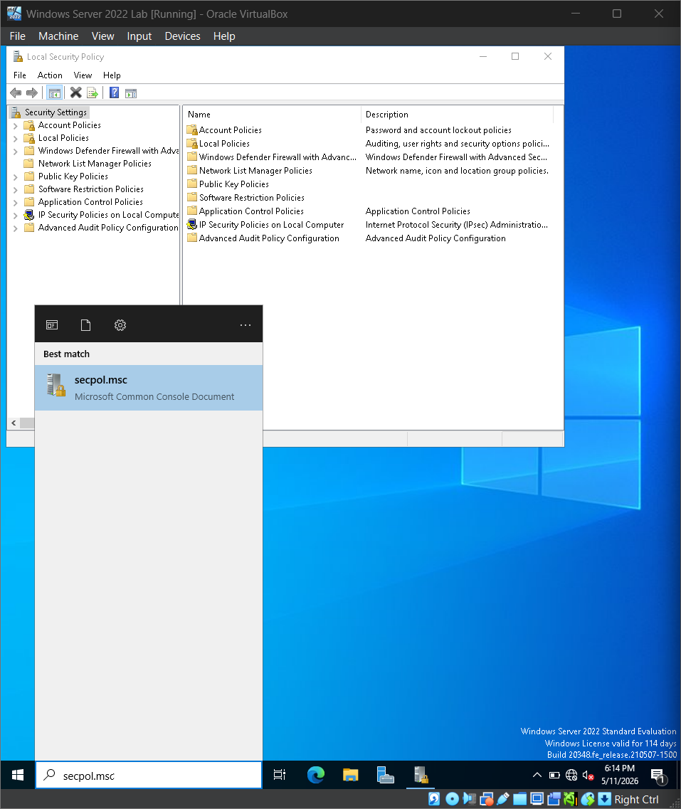
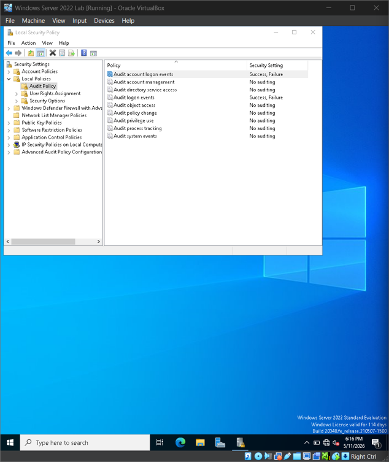
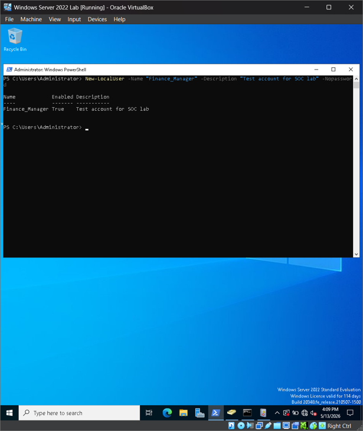
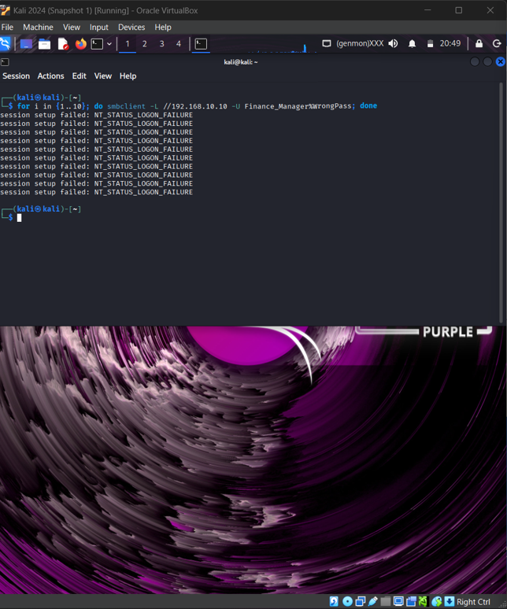
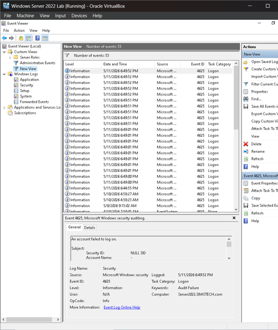
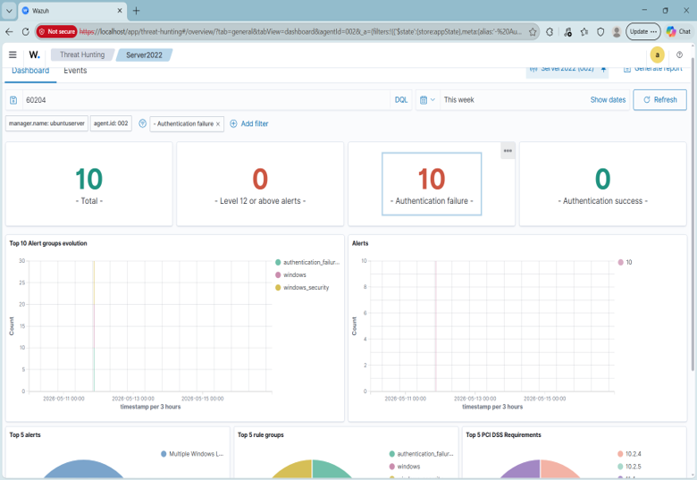

## Project: Active Directory Brute-Force Detection & SIEM Correlation

**Objective:**
To engineer a functional security pipeline that detects unauthorized authentication attempts on a Windows Server 2022 domain environment using Wazuh SIEM and Kali Linux. This project demonstrates the ability to configure endpoint telemetry, simulate an adversary's tactics, and verify the resulting security correlation.

### Phase 1: Endpoint Hardening & Audit Policy Configuration
Standard Windows installations do not provide the granular visibility required for modern threat detection. To establish a baseline for visibility, the following configurations were applied:

* **Policy Initialization:** Accessed the Local Security Policy console via `secpol.msc` to initialize advanced audit configurations for the domain environment.



*(Accessing the Windows Local Security Policy console to initialize advanced audit configuration.)*

* **Telemetry Activation:** Navigated to `Security Settings > Local Policies > Audit Policy` and enabled **Success** and **Failure** auditing for both **Logon events** and **Account logon events**. This ensures the generation of Event ID 4625 (Logon Failure) telemetry for all unauthorized attempts.



*(Enabling 'Success' and 'Failure' auditing for logon events to ensure the generation of Event ID 4625 telemetry.)*

* **Provisioning Targeted Identity:** Utilized PowerShell (Admin) to provision a sacrificial local user, `Finance_Manager`, establishing a high-value target for adversary credential guessing simulations.

```powershell
New-LocalUser -Name "Finance_Manager" -Description "Test account for SOC lab" -Nopassword

```


*(Utilizing PowerShell to provision the Finance_Manager sacrificial account.)*

### Phase 2: Adversary Simulation (Simulating Brute Force)
With telemetry active, a controlled "Password Spray" attack was simulated from an external adversary platform to test the SIEM’s alerting thresholds.

* **Platform Execution:** Utilized a Kali Linux instance to execute network-based authentication requests against the target.
* **Attack Mechanism:** Deployed a bash loop leveraging `smbclient` to attempt 10 consecutive failed logins against the target Windows Server IP (`192.168.10.10`).
 
```bash
for i in {1..10}; do smbclient -L //192.168.10.10 -U Finance_Manager%WrongPass; done

```



*(Executing a controlled SMB brute-force attack from Kali Linux to generate rapid authentication failures.)*

### Phase 3: Forensic Analysis & SIEM Validation
The final phase validates that the generated "noise" was successfully ingested, parsed, and correlated by the SOC stack.

* **Log Verification:** Accessed the Windows Event Viewer and applied a filter for Event ID 4625 to confirm the local generation of audit failures following the attack.



*(Reviewing the Windows Security Log to verify the local generation of Audit Failure events.)*

* **SIEM Correlation:** Navigated to the Wazuh Dashboard to verify that the individual failure logs were correlated into a high-priority security event. 
* **Detection Integrity:** Successfully identified **Rule 60204 (Multiple Windows Logon Failures)**, confirming that the SIEM correctly flagged the attack pattern and mapped it to global security frameworks like PCI DSS.



*(Wazuh SIEM Dashboard displaying the successful correlation of raw logs into a High-Severity (Level 10) Brute-Force alert.)*

### Lessons Learned & Mitigation Strategies

* **Remediation Suggestion (Account Lockout Policy):** To proactively mitigate password spray and brute-force attacks, it is recommended to implement a strict Account Lockout Policy via Group Policy Objects (GPO). Setting a threshold to lock accounts after 3 failed attempts within a specific window significantly increases the cost of the attack for an adversary and prevents automated credential guessing.
* **Resource Management:** During the detection phase, the SIEM indexer required a manual resource increase to 2 vCPUs and 4GB RAM to handle high-volume telemetry indexing without causing a system lockup.
* **Network Persistence:** Identified and resolved a "post-crash" connectivity issue where secondary network interfaces (`enp0s8`) required manual IP re-assignment (`192.168.10.5`) to restore the telemetry heartbeat between the agent and the manager.
* **Compliance Mapping:** Successfully demonstrated how technical alerts map to global security standards, specifically addressing PCI DSS 10.2.4 and 10.2.5 regarding the monitoring of all administrative access and failed authentication attempts.
